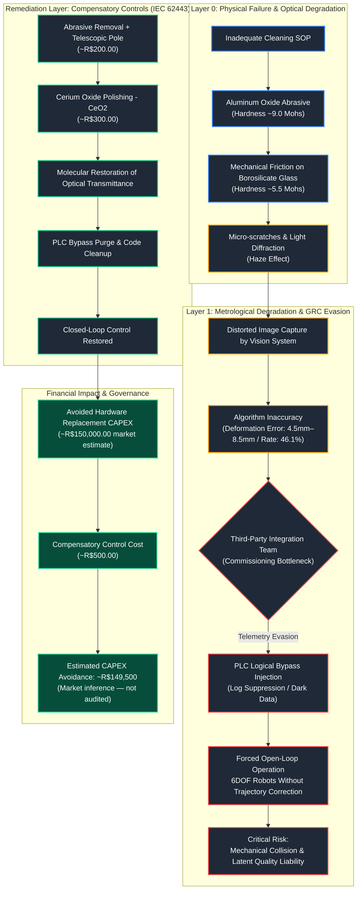

> **Status:** Proposal not implemented. Organizational barriers
> prevented formal presentation to technical leadership within
> the employment period. All financial figures (estimated CAPEX
> avoidance of ~R$150,000) are market inferences produced by
> the author, not audited values.

> **Evidence available:** Technical dossier (16 pages),
> photographic record of optical degradation, system log
> screenshots — available upon request for verified
> professional contacts.

---

# Computer Vision System Failure & PLC Bypass — Field Diagnostic Report

**Classification:** Public Portfolio Artifact — Field Diagnosis
**Reference Frameworks:** ISA/IEC 62443-3-3 (FR 3 - System Integrity /
FR 2 - Use Control) | NIST SP 800-82 Rev 3
**Environment:** Large automotive robotic painting cell
**Date:** March 2026
**Author:** Eurique Sales de Macedo
**Role at time of diagnosis:** Robot Operator — Top Coat Line

---

## 1. Executive Summary

This field diagnostic report maps a critical governance failure
at the logical and physical layers of a high-precision cyber-physical
manufacturing cell. The industrial computer vision system responsible
for real-time 6DOF trajectory correction of multi-axis robotic arms
was operating with a **46.1% inaccuracy rate**, under an undocumented
PLC bypass loop injected by a third-party integration team.

**Key findings:**
- Active open-loop operation for critical vehicle models —
  robots executing blind fixed trajectories without positional feedback
- Root cause: optical degradation from abrasive maintenance procedures
  (aluminum oxide fiber, ~9.0 Mohs, on borosilicate viewports, ~5.5 Mohs)
  inducing the Haze Effect and systematic deformation errors of 4.5–8.5mm
- Undocumented PLC bypass suppressing telemetry logs for affected models
  (Dark Data) — ISA/IEC 62443 FR3 and FR2 violation
- Proposed low-cost remediation (~R$500) versus hardware replacement
  (~R$150,000 market estimate)

**Outcome:** Proposal not implemented due to organizational barriers.
Documented as a governance failure case study.

---

---

## 2. Strategic Role of the Vision System in OT Safety

The computer vision system is the metrological core of the painting cell.
It ensures synchronization between the physical position of the vehicle
body and the precision trajectory of the robotic arms.

**Operational flow:**
1. **Trigger:** RFID sensor identifies vehicle model and activates
   mechanical safety lock on the transport skid
2. **Optical Capture:** Vision system fires illumination array and
   captures a 3D image of the body position
3. **6DOF Vector Calculation:** Software compares real image against
   the mathematical CAD reference model, generating correction offsets
   in X, Y, Z, RX, RY, RZ axes
4. **Robotic Execution:** Offset coordinates sent to robotic arms for
   real-time trajectory adjustment before paint application begins

**OT Security relevance:**
Without dynamic correction, robots operate in open-loop mode —
executing a static pre-programmed trajectory without positional feedback.
In high-voltage environments (kV electrostatic atomizers), this creates
direct collision risk and potential arc discharge damage to actuators
and end-effectors.

---

## 3. Performance Diagnosis & Error Analysis

**Identified inaccuracy rate: 46.1%**

Operational data extracted from the vision system online protocol:

- Predominance of "Result inaccurate!" status logs across production cycles
- Deformation error peaks of 7.56mm to 8.50mm on active vehicle models
- Critical models generating zero log entries on passage —
  complete suppression of vision system functionality (Dark Data)

**The Metrological False Positive:**
The ~8mm deformation error was not a real mechanical displacement.
Vehicle bodies were mechanically locked on the transport skid by
the safety fixture. The error was a metrological artifact — the
algorithm attempting to match the CAD reference model against a
diffracted, haze-distorted image, detecting phantom edge coordinates
that did not physically exist.

---

## 4. Root Cause Analysis — Optical Degradation

**Physical failure mechanism (materials science):**

Mohs Hardness Scale applied:
- Borosilicate glass optical viewport: **~5.5 Mohs**
- Abrasive cleaning fiber in use (aluminum oxide compound): **~9.0 Mohs**

Each cleaning pass with incompatible abrasive material acted as a
microscale machining tool on the optical surface.

**Three-stage destruction cycle:**

**Stage 1 — Mechanical Abrasion:**
Aluminum oxide fibers create microscopic grooves on the borosilicate
surface. Light that should pass linearly to the sensor instead strikes
groove walls and undergoes irregular diffraction and refraction,
producing the Haze Effect and drastically reducing image contrast.

**Stage 2 — Varnish Entrapment (Capillary Effect):**
During active painting cycles, liquid clear coat varnish (low surface
tension, high capillarity in solvent phase) infiltrates the microscopic
grooves. Catalyst triggers in-situ polymerization — varnish cures
inside the groove and becomes structurally bonded to the lens surface.
Subsequent solvent cleaning passes over the groove without reaching
the embedded varnish deposit.

**Stage 3 — Refractive Index Distortion:**
Cured varnish deposits (refractive index n≈1.5) inside the glass
create localized optical discontinuities. Light passing through the
viewport encounters varnish pockets and changes direction, generating
ghost edges and blurred contours in the vision algorithm input.

**Ergonomic aggravating factor:**
Robotic arms RBL 300/400 in Home position blocked perpendicular
access to cameras 03 and 04. Operators could effectively clean only
~25% of the optically relevant surface area, leaving the central
triangulation zone permanently obstructed regardless of cleaning
frequency.

---

## 5. PLC Bypass — OT Governance Violation

Rather than resolving the optical root cause, the third-party
integration team injected a permanent undocumented logical bypass
into the PLC program to mask the commissioning bottleneck:

**Bypass mechanism:**
- When RFID signature of affected vehicle models is detected,
  the vision module processing block is skipped entirely
- Central monitoring interfaces hardcoded to generate zero error
  flags for these models
- Result: **Dark Data state** — systemic metrological failure
  fully masked from operational oversight, presenting fraudulent
  nominal status to local management

**Regulatory non-compliance mapping:**

| Framework | Clause | Violation | Severity |
|:---|:---|:---|:---|
| ISA/IEC 62443-3-3 | FR 3 - System Integrity | Unauthorized suppression of safety-related PLC logic and deactivation of real-time metric feedback | **Critical** |
| ISA/IEC 62443-3-3 | FR 2 - Use Control | Permanent parameter modification by external vendor without cryptographic traceability or GRC validation | **High** |
| ISA/IEC 62443-4-1 | Secure Product Development | Supply chain deployment failure — undocumented logic integrated into production environment | **Critical** |
| ISO 10218-2 | Industrial Robot Safety | Multi-axis robotic system operating in open-loop mode, bypassing original safety-engineered thresholds | **Critical** |

---

## 6. Remediation Proposal

**Total estimated cost: ~R$500.00**
(versus ~R$150,000.00 market estimate for hardware replacement)

### 6.1 Optical Asset Recovery — Cerium Oxide (CeO2) Polishing
Cerium oxide compound reacts chemically with borosilicate glass surface,
leveling micro-scratches at molecular scale via controlled
chemo-mechanical polishing. This process eliminates the Haze Effect
and restores original optical transmittance without hardware replacement.
- Estimated material cost: ~R$300.00

### 6.2 New Preventive Maintenance Standard
- Permanent ban of aluminum oxide abrasive materials from
  optical maintenance procedures
- Articulating telescopic extension pole (up to 3m reach) enabling
  perpendicular lens access from ground level — eliminates
  improvised elevated access and NR-35 fall risk
- Ultra-low roughness microfiber cloth as safe abrasive-free substitute
- Estimated kit cost: ~R$200.00

### 6.3 PLC Code De-Bypassing & Integrity Controls
- Purge of undocumented third-party bypass blocks from PLC program
- Restoration of mandatory 6DOF metrological verification for
  all vehicle model profiles
- Implementation of program hash/checksum baseline for automated
  detection of future unauthorized logic modifications

---

## 7. Financial Analysis

| Metric | Value |
|:---|:---|
| Estimated hardware replacement cost (market) | ~R$150,000.00 |
| Proposed remediation implementation cost | ~R$500.00 |
| Estimated CAPEX avoidance | ~R$149,500.00 |
| Calculation basis | Author market inference — not audited |

> **Transparency note:** All financial figures above are market
> inferences produced by the author based on estimated industrial
> vision system hardware pricing. These values were not audited,
> approved, or validated by the organization.

---

## 8. Status & Governance Lessons

**This proposal was not implemented.**

Organizational barriers prevented formal presentation to technical
leadership within the employment period. The diagnostic dossier was
produced and delivered internally in March 2026, 75 days after the
start of employment.

**What this reveals about OT risk governance:**

The failure was not technical — it was structural. An operator-level
employee identified an ISA/IEC 62443 FR3 violation, quantified the
financial impact, and produced a low-cost remediation plan.
The absence of a formal channel for operator-level technical
diagnoses to reach engineering leadership is itself a governance
failure — precisely the type of gap that frameworks like
ISA/IEC 62443 and NIST SP 800-82 exist to address.

This experience was the direct trigger for a formal transition
into OT Cybersecurity.
